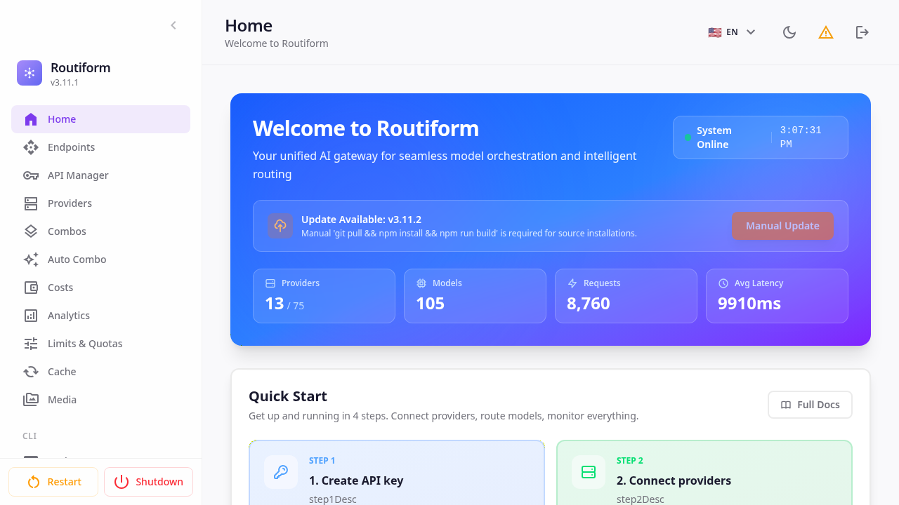
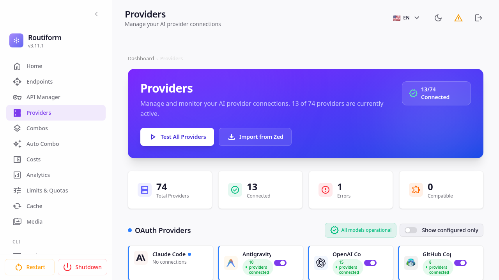
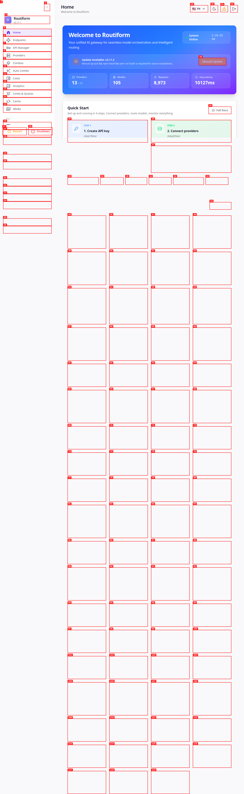
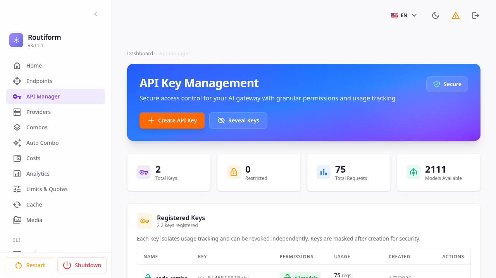
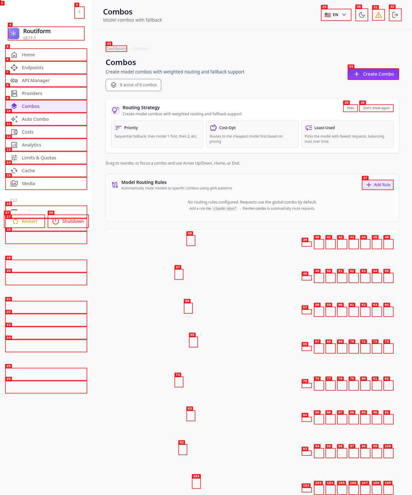

     1|File unchanged since last read. The content from the earlier read_file result in this conversation is still current — refer to that instead of re-reading.
     2|
     3|## Dashboard Overview
     4|
     5|Routiform's intuitive dashboard provides a single pane of glass for all your AI gateway operations. Monitor usage, manage providers, configure routing policies, and gain deep insights into your AI infrastructure.
     6|
     7|
     8|
     9|## Core Capabilities in Action
    10|
    11|Witness Routiform's power with these feature highlights:
    12|
    13|### Unified Provider Management
    14|
    15|Effortlessly connect and manage 75+ AI model providers. Activate, configure, and monitor all your AI sources from one centralized interface.
    16|
    17|
    18|
    19|### Intelligent Routing with Combos
    20|
    21|Build flexible routing policies with combos. Define fallback strategies, weighted distributions, and cost-aware routing to optimize performance and spend.
    22|
    23|
    24|
    25|### Secure API Key Management
    26|
    27|Control and secure API access with granular permissions. Create, manage, and monitor dedicated API keys for different applications and users.
    28|
    29|
    30|
    31|### Robust System Configuration
    32|
    33|Access and manage all system settings, from database and storage to log retention policies, ensuring complete control over your Routiform instance.
    34|
    35|
    36|

## Dashboard Overview

Routiform’s intuitive dashboard provides a single pane of glass for all your AI gateway operations. Monitor usage, manage providers, configure routing policies, and gain deep insights into your AI infrastructure.

## Core Capabilities in Action

Witness Routiform’s power with these feature highlights:

### Unified Provider Management

Effortlessly connect and manage 75+ AI model providers. Activate, configure, and monitor all your AI sources from one centralized interface.

### Intelligent Routing with Combos

Build flexible routing policies with combos. Define fallback strategies, weighted distributions, and cost-aware routing to optimize performance and spend.

### Secure API Key Management

Control and secure API access with granular permissions. Create, manage, and monitor dedicated API keys for different applications and users.

### Robust System Configuration

Access and manage all system settings, from database and storage to log retention policies, ensuring complete control over your Routiform instance.

