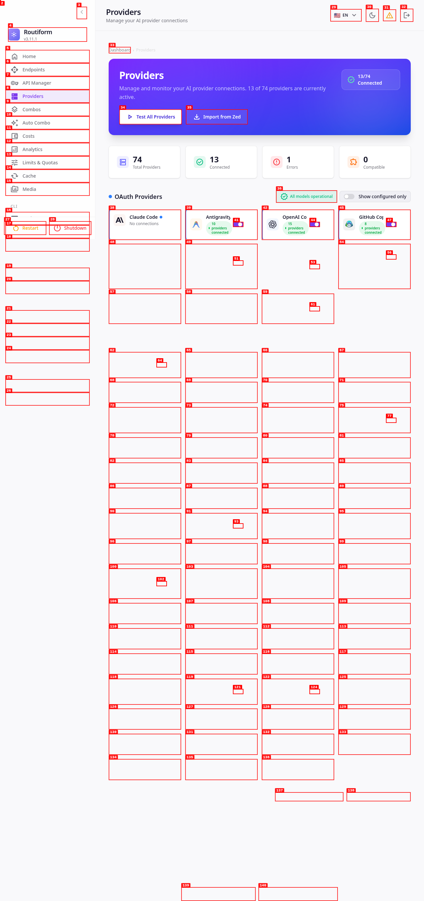
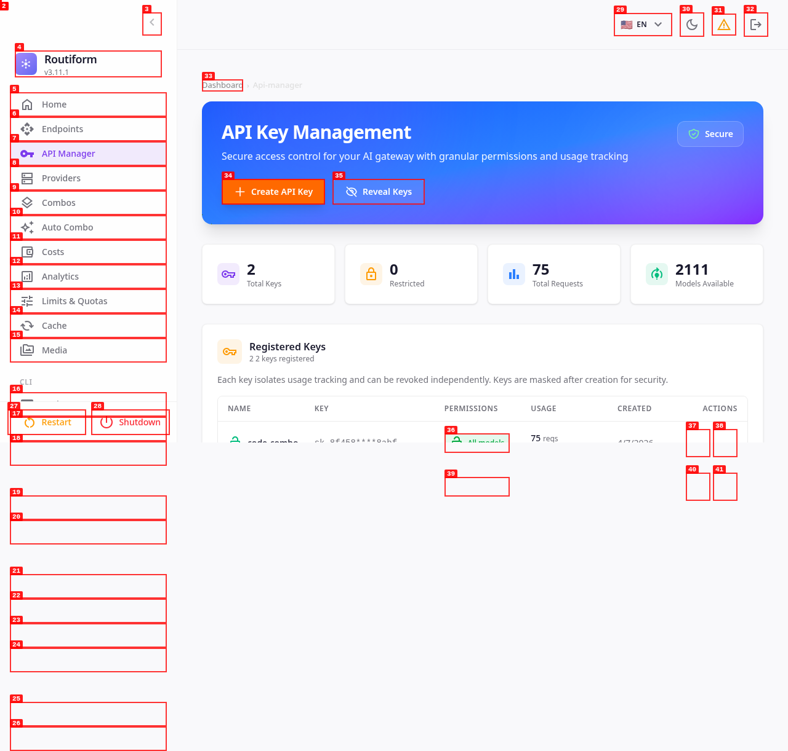
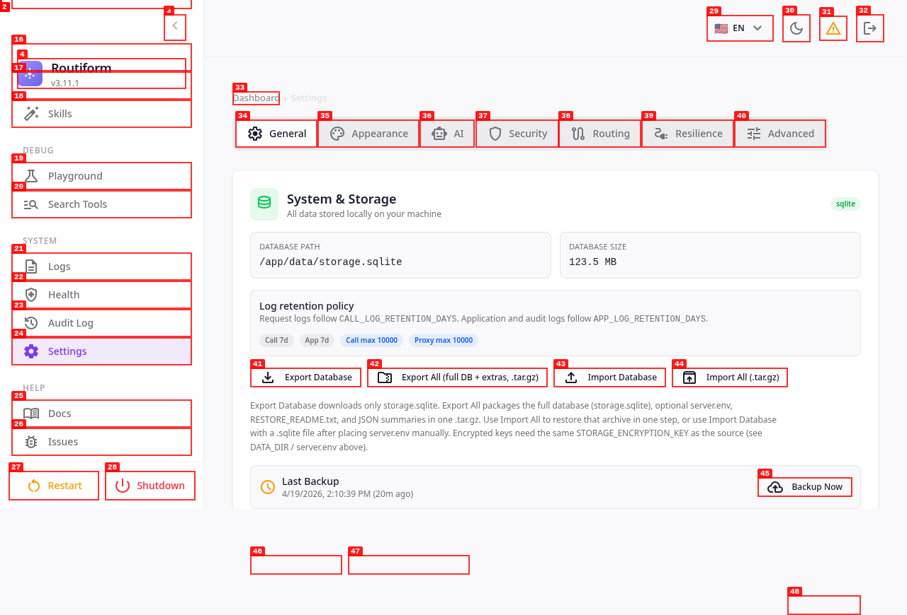

     1|## Dashboard Overview
     2|
     3|Routiform’s intuitive dashboard provides a single pane of glass for all your AI gateway operations. Monitor usage, manage providers, configure routing policies, and gain deep insights into your AI infrastructure.
     4|
     5|
     6|
     7|## Core Capabilities in Action
     8|
     9|Witness Routiform’s power with these feature highlights:
    10|
    11|### Unified Provider Management
    12|
    13|Effortlessly connect and manage 75+ AI model providers. Activate, configure, and monitor all your AI sources from one centralized interface.
    14|
    15|
    16|
    17|### Intelligent Routing with Combos
    18|
    19|Build flexible routing policies with combos. Define fallback strategies, weighted distributions, and cost-aware routing to optimize performance and spend.
    20|
    21|
    22|
    23|### Secure API Key Management
    24|
    25|Control and secure API access with granular permissions. Create, manage, and monitor dedicated API keys for different applications and users.
    26|
    27|
    28|
    29|### Robust System Configuration
    30|
    31|Access and manage all system settings, from database and storage to log retention policies, ensuring complete control over your Routiform instance.
    32|
    33|
    34|

## Visual Highlights: Routiform in Action

Experience the power, simplicity, and control of Routiform’s unified AI gateway through these key dashboard views.

### Dashboard Overview

Routiform’s intuitive dashboard provides a single pane of glass for all your AI gateway operations. Monitor usage, manage providers, configure routing policies, and gain deep insights into your AI infrastructure.

### Unified Provider Management

Effortlessly connect and manage 75+ AI model providers. Activate, configure, and monitor all your AI sources from one centralized interface.

### Intelligent Routing with Combos

Build flexible routing policies with combos. Define fallback strategies, weighted distributions, and cost-aware routing to optimize performance and spend.

### Secure API Key Management

Control and secure API access with granular permissions. Create, manage, and monitor dedicated API keys for different applications and users.

### Robust System Configuration

Access and manage all system settings, from database and storage to log retention policies, ensuring complete control over your Routiform instance.

